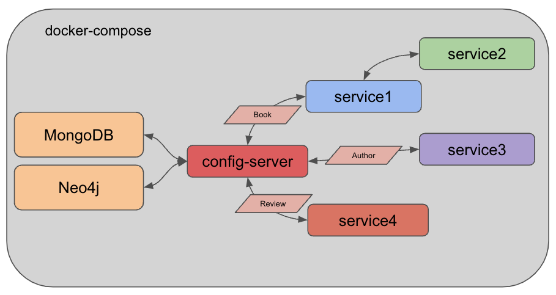

= Microservices Project: Level 9

This project is part of a series for creating microservices. In this repository, we use the following technologies:

* Spring Boot
* Java
* REST services
* Lombok
* Spring Data
* MongoDB document database
** loaded with Book/Author domain data
* Docker and docker compose
* Neo4j AuraDB free tier
** load with Book/Author/Review domain data
* Spring Cloud Config
* Spring Retry

For the domain, we loaded a publicly-available https://sites.google.com/eng.ucsd.edu/ucsdbookgraph/home?authuser=0[UCSD Book Graph dataset^] that provides books and related information.

== Architecture

We have 4 data services in this repository: `service1`, `service2`, `service3`, and `service4`. Responsibilities of each service are outlined below, followed by the changes to execution.

* Service1: backend service hosting the REST api for book data (MongoDB)
* Service2: client REST service for calling service1 and returning books
* Service3: backend service hosting the REST api for author data (MongoDB)
* Service4: backend service hosting the REST api for review data (Neo4j)

We also have a few supporting folders explained below.

* Config-server: application service to set up the config server managing database credentials for applications
* Data-neo4j: folder that includes steps and script for loading data set on books, authors, and reviews to Neo4j.
* Docker-mongodb: folder containing steps and data for starting and loading books and authors data to MongoDB Docker container.
* Microservices-java-config: holds sample YAML files containing database credentials. *Note:* Details on how to use the config are in this folder.

Services 1-4, the config-server, and MongoDB have been packaged into Docker containers, and we are using https://docs.docker.com/compose/[Docker Compose^] to run and manage the services together.

== Microservices functions

There are a variety of reasons businesses and users might choose to develop applications in a microservices architecture. Some potential reasons are listed below.

* Scalability
* Functionality independence (separating grouped features, often for reliability)
* Maintenance simplicity (changes only affect pieces, and less likely to impact whole)
* Shift resource load (from large instance running single monolith application, to many smaller instances hosting/coordinating microservices)

== Executing the services
To reproduce this example, please follow the steps.

 1. Clone this repository
 2. Create a free Neo4j AuraDB instance and load data using the steps in the `data-neo4j` folder.
 3. Build each Docker container (docker-mongodb, config-server, service1, service2, service3, service4). Note: if not on arm64 silicon chip, will also need to update Docker image names in compose file.
 4. Execute Docker compose with `docker-compose up -d`.
 5. Test the config server (MongoDB): Open a command line window and execute `curl localhost:8888/mongo-client/docker`.
 6. Test backing service (books): Open a command line window and execute `curl localhost:8081/db`, `curl localhost:8081/db/books`, and `curl localhost:8081/db/book/623a1d969ff4341c13cbcc6b`.
 7. Test backing service (authors): Open a command line window and execute `curl localhost:8082/db`, `curl localhost:8082/db/authors`, and `curl localhost:8082/db/author/623a48c1b6575ea3e899b164`.
 8. Test client service: Open a command line window and execute `curl localhost:8080/goodreads` and `curl localhost:8080/goodreads/books`.
 9. Test the config server (Neo4j): Open a command line window and execute `curl localhost:8888/neo4j-client/docker`.
 10. Test review backing service: Open a command line window and execute `curl localhost:8083/neo`, `curl localhost:8083/neo/reviews` or `curl localhost:8083/neo/reviews/178186`.
 11. Verify all results! :)

== Content

* Blog post: https://jmhreif.com/blog/2022/microservices-level9/[Microservices Level 9^]

== Previous steps

* https://github.com/JMHReif/microservices-level1[Level1] - Sending a string message from one Spring Boot app to another
* https://github.com/JMHReif/microservices-level2[Level2] - Retrieving prepopulated Book data from one Spring Boot app to another
* https://github.com/JMHReif/microservices-level3[Level3] - Storing Book data in MongoDB and retrieving all stored books
* https://github.com/JMHReif/microservices-level4[Level4] - Adding new service for author data
* https://github.com/JMHReif/microservices-level5[Level5] - Adding Docker compose to manage services as containers
* https://github.com/JMHReif/microservices-level6[Level6] - Adding new service for review data (in Neo4j)
* https://github.com/JMHReif/microservices-level7[Level7] - Adding Spring Cloud Config to manage Neo4j credentials
* https://github.com/JMHReif/microservices-level8[Level8] - Adding MongoDB credentials to Spring Cloud Config